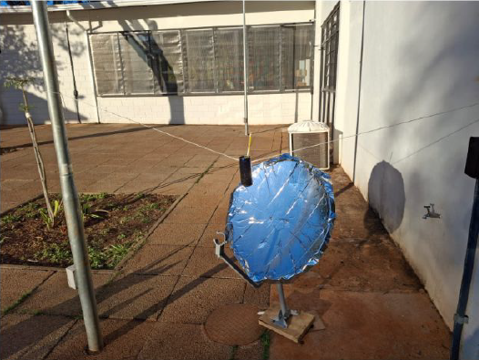

# ☀️ Solaris – Energy from the Sun to Your Plate

### Award-winning solar thermal concentrator developed through theoretical modeling, prototyping, and experimental validation.

🏆 **3rd Place Award** — EX067: Development and Prototyping of Social Impact Projects in a Maker Environment (UNICAMP, 2025)

---

## 📖 Overview

**Solaris** was an interdisciplinary engineering project developed by undergraduate students from Engineering Physics, Applied Mathematics, and Mechanical Engineering.

The project investigated the use of concentrated solar energy as a low-cost and sustainable solution for thermal applications. By combining theoretical analysis, prototyping, and experimental testing, the team explored how accessible materials could be used to convert solar radiation into useful thermal energy.

---

## 📸 Prototype



*Experimental solar concentrator built during the Solaris project.*

The prototype consists of a reflective parabolic structure designed to focus incoming solar radiation onto a focal region, increasing the available thermal power for heating applications.

---

## 🎓 Academic Context

Solaris was developed during the undergraduate course:

**EX067 – Development and Prototyping of Social Impact Projects in a Maker Environment**
(*Desenvolvimento e prototipagem de projetos de impacto social em ambiente Maker*)

**University of Campinas (UNICAMP)**
**First Semester of 2025**

The course focuses on project-development methodologies, maker-space prototyping, and proof-of-concept validation for products and services with potential social impact.

As part of this initiative, the Solaris team proposed, designed, modeled, prototyped, and experimentally evaluated a low-cost solar thermal concentrator.

---

## 🏆 Recognition

The Solaris project was awarded **3rd Place** in the final project competition of the course.

The award recognized the project's integration of:

* Engineering design;
* Physical modeling;
* Prototype development;
* Experimental validation;
* Social-impact oriented innovation.

---

## 🎯 Objectives

* Develop a low-cost solar thermal concentrator;
* Investigate the use of solar energy for heating applications;
* Study heat transfer mechanisms involved in the system;
* Build and experimentally validate a functional prototype;
* Explore sustainable alternatives based on renewable energy.

---

## 🧠 Design Process

The project followed a Design Thinking methodology:

1. Problem identification;
2. Ideation and concept development;
3. Theoretical analysis;
4. Prototype construction;
5. Experimental testing;
6. Validation and refinement.

This iterative workflow allowed continuous interaction between theoretical predictions and practical observations.

---

## 🔬 Theoretical Modeling

The thermal behavior of the system was described through an energy balance involving:

* Solar radiation absorption;
* Thermal radiation losses;
* Convective heat exchange with the environment.

The resulting nonlinear differential equation was used to estimate the temperature evolution of the system and guide design decisions throughout the project.

---

## 💻 Computational Study

Numerical simulations were performed to investigate the thermal response of the system under different operating conditions.

This repository contains an independent implementation inspired by the theoretical framework developed during the Solaris project and is intended to illustrate the physical principles explored during its development.

The numerical model is based on the solution of the governing energy-balance equation using the Fourth-Order Runge-Kutta (RK4) method.

---

## 🛠️ Materials

| Component                       |          Cost |
| ------------------------------- | ------------: |
| Parabolic satellite dish        |      R$ 94.45 |
| Reflective Mylar insulation     |      R$ 38.88 |
| Candles (thermal storage tests) |      R$ 12.29 |
| **Total Cost**                  | **R$ 145.62** |

The use of commercially available materials enabled the construction of a low-cost experimental system while maintaining functionality and ease of assembly.

---

## 📈 Experimental Results

Experimental tests demonstrated the ability of the prototype to concentrate solar radiation and generate significant heating effects.

Observed outcomes included:

* Heating of dry leaves placed near the focal region;
* Heating of MDF samples exposed to concentrated sunlight;
* Verification of the concentrator's ability to deliver usable thermal energy;
* Validation of the proposed proof of concept.

These observations provided qualitative confirmation of the expected thermal behavior of the system.

---

## 📊 Numerical Results

The computational model predicts the temperature evolution of the system and allows the investigation of different environmental and operational conditions.

Simulation studies can be used to evaluate:

* Solar irradiance effects;
* Thermal equilibrium conditions;
* Convective heat losses;
* Radiative heat losses;
* Design optimization strategies.

---

## 🚀 Technologies Used

### Engineering & Physics

* Heat Transfer
* Thermal Radiation
* Energy Balance Analysis
* Renewable Energy Systems

### Programming

* Python
* NumPy
* Matplotlib

### Numerical Methods

* Fourth-Order Runge-Kutta (RK4)
* Numerical Solution of Differential Equations

---

## 📂 Repository Structure

```text
Solaris/
│
├── solar-oven.py
├── README.md
├── LICENSE
│
└── figures/
    ├── prototype.jpg
    ├── simulation.png
    ├── results_1.jpg
    └── results_2.jpg
```

---

## 👥 Team

Developed for:

**EX067 – Development and Prototyping of Social Impact Projects in a Maker Environment**
**University of Campinas (UNICAMP)**

Instructor:

**Prof. Eder Socrates Najar Lopes**

Team members:

* Gustavo Sobreira Barroso — Engineering Physics
* João Luís Motta Martinez — Applied Mathematics
* Lucas Inoue Kuhl Silva — Applied Mathematics
* Ryan Pereira Pedrozo — Mechanical Engineering

---

## 🌎 Impact

Solaris demonstrates how scientific modeling, engineering design, and maker-based prototyping can be combined to create accessible renewable-energy technologies with potential social impact.

The project highlights the role of interdisciplinary collaboration in the development of sustainable engineering solutions.

---

## 📜 License

This repository is distributed under the MIT License.

